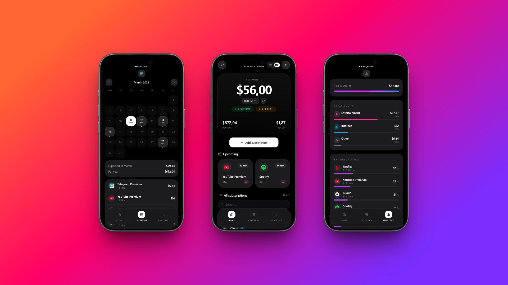

# CheckUrSubs 📱

> A minimalist subscription tracker. Know exactly what you pay — every month.


**[→ Open the app](https://checkursubs.vercel.app)**

---

## About

CheckUrSubs helps you keep track of all your subscriptions — streaming, cloud storage, SaaS tools, mobile plans. See your total spend, upcoming charges, and a breakdown by category.

Works as a PWA — installs to your home screen on iPhone and Android with no App Store required.



---

## Features

### Core
- 📊 **Dashboard** — total per month, year, and day; full subscription list
- 📅 **Calendar** — see exactly when and how much will be charged, day by day
- ⏰ **Upcoming** — charges due in the next 7 days
- 📈 **Analytics** — spending by category and service with progress bars
- 🌍 **Multi-currency** — RUB, USD, EUR, GBP and more with live exchange rates
- 🌐 **RU / EN** — full localization with auto-detection by browser language

### Subscriptions
- 🔖 **11 categories** — Entertainment, Work, Internet, Games, Education, VPN, Health, Banking, Telecom, AI, Other
- 🔍 **Autocomplete** — recognizes 60+ popular services, fills in logo and category automatically
- 📆 **Monthly & yearly** billing with correct cost calculations
- ↔️ **Swipe gestures** — left to delete, right to edit
- ↩️ **Undo delete** — 5 seconds to change your mind

### Subscription statuses
- ✅ **Active** — included in totals and shown in calendar
- ⏸️ **Paused** — excluded from totals, hidden from calendar
- 🔬 **Trial** — shown in calendar until trial end date, excluded from totals; automatically becomes active after trial ends

### UX
- 🎨 **Dark UI** — clean, native feel
- 🔐 **Auth** — email/password or Google OAuth
- 📲 **PWA** — offline cache, home screen icon, no browser chrome
- 🔔 **Push notifications** — reminder 3 days before billing or trial end
- 🧭 **Onboarding** — 6-slide walkthrough including PWA install instructions
- 📭 **Empty states** — thoughtful screens when there's nothing to show

---

## Stack

| Layer | Technology |
|-------|-----------|
| UI | React 19, Tailwind CSS 4, Framer Motion |
| Build | Vite 7 |
| Backend | Supabase (Postgres + Auth + RLS + Edge Functions) |
| Push | Web Push API + VAPID + Supabase Edge Functions + pg_cron |
| Monitoring | Sentry (errors + session replays) |
| Analytics | PostHog (events, funnels, retention) |
| Deploy | Vercel |
| Icons | Lucide React |

---

## Getting Started

```bash
# Clone
git clone https://github.com/casablanque-code/CheckUrSubs.git
cd CheckUrSubs

# Install dependencies
npm install

# Create env file
cp .env.example .env
# Fill in VITE_SUPABASE_URL and VITE_SUPABASE_ANON_KEY

# Start dev server
npm run dev
```

---

## Environment Variables

```env
VITE_SUPABASE_URL=your_supabase_url
VITE_SUPABASE_ANON_KEY=your_supabase_anon_key
```

Get these from [Supabase Dashboard](https://supabase.com) → Settings → API.

---

## Database

Main migration — `supabase_migration.sql`.  
Push subscriptions — `push_migration.sql`.  
Run both in the Supabase SQL Editor.

`subscriptions` table schema:

```sql
id            uuid primary key
user_id       uuid references auth.users
name          text
price         numeric
currency_code text
date          text        -- billing day, format "8 Mar"
period        text        -- 'monthly' | 'yearly'
category      text
logo          text
status        text        -- 'active' | 'paused' | 'trial'
trial_end     date        -- trial end date
created_at    timestamptz
```

`push_subscriptions` table schema:

```sql
id            uuid primary key
user_id       uuid references auth.users
subscription  text        -- JSON Web Push subscription object
updated_at    timestamptz
```

Row Level Security is enabled — users only see their own data.

---

## Push Notifications

Implemented via Web Push API + VAPID.

**Deploy Edge Function:**
```bash
supabase functions deploy send-push-notifications --project-ref YOUR_REF
```

**Set secrets in Supabase:**
```
VAPID_PUBLIC_KEY=...
VAPID_PRIVATE_KEY=...
```

**Schedule** — pg_cron triggers the function daily at 10:00 UTC (`push_cron.sql`).

Sends a notification 3 days before:
- A subscription billing date
- A trial period end date

---

## Deploy

```bash
# Preview
vercel

# Production
vercel --prod
```

Add env vars in Vercel Dashboard → Settings → Environment Variables.

---

## Installing as PWA

**iPhone:** open in Safari → tap Share → "Add to Home Screen"

**Android:** open in Chrome → menu → "Install app"

> Push notifications on iOS require PWA install (iOS 16.4+)

---

## Service Worker & Updates

The app uses a custom Service Worker (`sw.js`) with:
- **Automatic update checks** on every app launch (not just every 24h)
- **Seamless background updates** — new version activates and reloads silently
- **Cache versioning** — Vite injects a build timestamp on every deploy, old caches are cleared automatically
- **Network-first** for HTML and navigation; **cache-first** for hashed JS/CSS assets

---

## Monitoring

- **Sentry** — catches JS errors, unhandled Promise rejections, Service Worker failures. Includes Session Replay on errors.
- **PostHog** — tracks key events: subscription add/delete, tab switches, currency changes, onboarding completion, push opt-in.

---

## License

MIT
