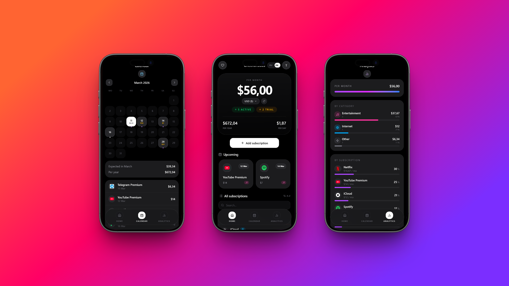

# CheckUrSubs

A minimalist subscription tracker. Know exactly what you pay — every month.

## Featured on Product Hunt

[](https://www.producthunt.com/products/checkursubs?utm_source=badge-featured&utm_medium=badge&utm_campaign=badge-checkursubs)


**[Open the app](https://checkursubs.casablanque.com/)**

---

## About

CheckUrSubs helps you keep track of all your subscriptions — streaming,
cloud storage, SaaS tools, mobile plans. See your total spend, upcoming
charges, and a breakdown by category, all in one place.

It works as a PWA and installs to your home screen on iPhone and Android,
no App Store required.



---

## Features

### Core
- **Dashboard** — total spend per month, per year, and the full subscription list
- **Calendar** — see exactly when and how much will be charged, day by day
- **Upcoming** — charges due in the next 7 days
- **Analytics** — spending by category and by service, with a monthly trend chart
- **Multi-currency** — RUB, USD, EUR, GBP and more, with live exchange rates
- **Russian / English** — full localization, auto-detected from the browser on first visit

### Subscriptions
- **11 categories** — Entertainment, Work, Internet, Games, Education, VPN, Health, Banking, Telecom, AI, Other
- **Autocomplete** — recognizes 60+ popular services and fills in the logo and category automatically
- **Monthly and yearly billing**, with correct totals for each
- **Swipe gestures** — swipe left to delete, right to edit
- **Undo delete** — a 5-second window to change your mind
- **Import and export** — CSV and JSON, with duplicate detection on import

### Subscription statuses
- **Active** — included in totals, shown in the calendar
- **Paused** — excluded from totals, hidden from the calendar
- **Trial** — shown in the calendar until the trial ends, excluded from totals, and switches to active automatically once it does

### Experience
- **Dark UI** with a clean, native feel
- **Auth** via email/password or Google OAuth
- **PWA** — offline cache, home screen icon, no browser chrome
- **Push notifications** — a reminder 3 days before a billing date or trial end
- **Onboarding** — a short walkthrough that includes PWA install instructions
- **Empty states** — considered screens for when there's nothing to show yet

---

## Stack

| Layer      | Technology                                                |
|------------|------------------------------------------------------------|
| UI         | React 19, Tailwind CSS 4, Framer Motion                    |
| Build      | Vite 7                                                      |
| Testing    | Vitest                                                      |
| CI         | GitHub Actions (lint, test, build on every push and PR)     |
| Backend    | Supabase (Postgres, Auth, RLS, Edge Functions)              |
| Push       | Web Push API, VAPID, Supabase Edge Functions, pg_cron        |
| Monitoring | Sentry (errors and session replays)                          |
| Analytics  | PostHog (events, funnels, retention)                          |
| Deploy     | Vercel                                                        |
| Icons      | Lucide React                                                  |

---

## Getting started

```bash
# Clone
git clone https://github.com/casablanque-code/CheckUrSubs.git
cd CheckUrSubs

# Install dependencies
npm install

# Create env file
cp .env.example .env
# Fill in VITE_SUPABASE_URL and VITE_SUPABASE_ANON_KEY

# Start the dev server
npm run dev
```

### Running tests and lint

```bash
npm run test    # run the test suite once
npm run test:watch
npm run lint
npm run build
```

These same four steps run in CI on every push and pull request.

---

## Environment variables

```env
VITE_SUPABASE_URL=your_supabase_url
VITE_SUPABASE_ANON_KEY=your_supabase_anon_key
```

Get these from the [Supabase dashboard](https://supabase.com) under Settings → API.

---

## Database

The main migration lives in `supabase_migration.sql`, push subscriptions in
`push_migration.sql`, price history tracking in `price_history_migration.sql`.
Run all three in the Supabase SQL Editor.

`subscriptions` table schema:

```sql
id            uuid primary key
user_id       uuid references auth.users
name          text
price         numeric
currency_code text
date          text        -- billing day, format "8 Mar"
period        text        -- 'monthly' | 'yearly'
category      text
logo          text
status        text        -- 'active' | 'paused' | 'trial'
trial_end     date        -- trial end date
price_history jsonb       -- past prices, newest first — see price_history_migration.sql
created_at    timestamptz
```

`push_subscriptions` table schema:

```sql
id            uuid primary key
user_id       uuid references auth.users
subscription  text        -- JSON Web Push subscription object
updated_at    timestamptz
```

Row Level Security is enabled — each user can only see their own data.

---

## Push notifications

Implemented via the Web Push API and VAPID.

**Deploy the edge function:**
```bash
supabase functions deploy send-push-notifications --project-ref YOUR_REF
```

**Set secrets in Supabase:**
```
VAPID_PUBLIC_KEY=...
VAPID_PRIVATE_KEY=...
```

**Schedule** — pg_cron triggers the function daily at 10:00 UTC (`push_cron.sql`).

A notification is sent 3 days before:
- a subscription's billing date
- a trial period's end date

---

## Deploy

```bash
# Preview
vercel

# Production
vercel --prod
```

Add the environment variables in the Vercel dashboard under Settings → Environment Variables.

---

## Installing as a PWA

**iPhone:** open in Safari, tap Share, then "Add to Home Screen".

**Android:** open in Chrome, open the menu, then "Install app".

Push notifications on iOS require the PWA to be installed (iOS 16.4+).

---

## Service worker and updates

The app uses a custom service worker (`sw.js`):
- checks for updates on every app launch, not just every 24 hours
- activates new versions and reloads silently in the background
- gets a fresh cache-version tag injected by Vite on every build, so old
  caches are cleared automatically
- serves HTML and navigation network-first, and hashed JS/CSS assets
  cache-first

---

## Monitoring

**Sentry** catches JS errors, unhandled promise rejections, and service
worker failures, and includes session replay on errors.

---

## Contributing

Pull requests are welcome. CI runs lint, tests, and a build on every PR —
please make sure `npm run test` and `npm run lint` pass locally first.

---

## License

MIT
